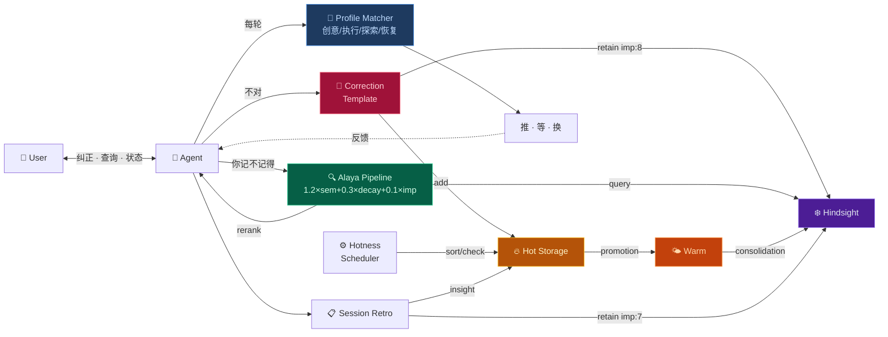

# Dopagent

你的 AI 助手每次被你纠正后，自动把教训存进长期记忆。下次遇到类似场景，经验自己浮上来。

[](https://github.com/CodaD276/Dopagent/stargazers)
[](LICENSE)
[](PORTING.md)

[繁體中文](README_ZH-TW.md) · [English](README_EN.md)

[快速开始](#快速开始) · [功能介绍](#这个-skill-能做什么) · [架构](#架构层次--architecture-layers) · [FAQ](#常见问题)

---

## 💡 这个 Skill 能做什么

> [!NOTE]
> Agent 被纠正 → 自动提取教训 → 存进记忆库。下一次你说"你记不记得"，最相关的经验排在第一位。

记性好了还不够。它知道**什么时候该推你一把、什么时候该闭嘴**——四个模式（创意/执行/探索/恢复）根据你的状态自动切换。

全部跑在本地。Python 标准库，零外部依赖。

> [!WARNING]
> Dopagent Check 是 LLM 推理步骤——Agent 每轮尽力执行，但无程序级强制保障。框架的可靠性在纠正闭环（纠正→retain→Alaya 召回）上，动机引擎是辅助层。

## 🚀 快速开始

```bash
# 1. 编辑配置——只需改两个路径
cp config_example.py config.py
# 打开 config.py，设置 WORKSPACE 和 SKILLS_DIR

# 2. 安装
python install.py

# 3. 引导 Agent
# 在 HanaAgent 聊天框中直接输入：
# "加载 dopagent skill"
#
# （HanaAgent 通过对话指令加载 skill——
#   输入后会读取 SKILL.md 并执行 bootstrap。）
```

### 验证安装

装完 30 秒确认一切正常：

```
1. 对 Agent 说一句明显错误的话，比如"深圳在广西"
2. Agent 纠正你之后，说"你记不记得我刚才纠正了什么？"
3. Agent 应该能召回刚才的纠正内容
```

纠正→记忆→检索——一整条回路，30 秒验证。

## 5 分钟 Walkthrough

装好之后，试试这个——最直观地感受框架怎么运转：

```
👤 User：  "深圳在广东省，不在广西省。"
           （← 这是一条纠正，但没显式说"记住"）

🤖 Agent： 检测到纠正信号 → 自动填模板：

           纠正模板：
           · 我错了：混淆了省份归属
           · 正确：深圳是广东省辖市
           · 下次：涉及中国地理先确认省份

           → retain 到 Hindsight（imp:8）
           → 写入热存储 [correction]
           → hotness.py sort → 这条浮到 ACTIVE 区顶部

👤 User：  （三天后）"我之前是不是纠正过你一个地理问题？"

🤖 Agent： python alaya_recall.py "地理 纠正"
           → Alaya 公式：语义相似度 + 时间衰减 + 重要性 三重加权
           → "深圳在广东" 排第一
           → "是的，7月13日你纠正我深圳在广东不在广西。"
```

四条回路一次跑通：纠正学习 → 记忆存储 → 检索重排 → 热存储生命周期。

---

## 前置条件

| 依赖 | 必需 | 说明 |
|---|---|---|
| Python 3.10+ | ✅ | 全部标准库，无需 pip install |
| curl | ✅ | HTTP 调用 Hindsight API |
| Hindsight daemon | ✅ | 长期记忆存储，默认 :9177 |
| HanaAgent | 🟨 | 原生支持。其他平台参考 [移植指南](PORTING.md) |
| 5 分钟 | ✅ | 改两个路径 + 跑一条命令 |

```
scripts/
  alaya_rerank.py   → json, math, datetime, sys      (stdlib only)
  alaya_recall.py   → json, subprocess, tempfile, sys  (stdlib only)
  hotness.py        → json, pathlib, re, datetime, sys (stdlib only)

系统工具: curl（调用 Hindsight HTTP API）
```

**开发与验证环境**：Windows 11 · HanaAgent · Hindsight

## 架构层次 / Architecture Layers

安装后你处在 **L1**。L0-L3 自动运行，L4-L5 等数据积累后自动激活。

| 层 | 名称 | 状态 | 触发方式 |
|---|---|---|---|
| **L0** | 基础设施 · Alaya 管道 + 热存储 + 冷存储 | ✅ 自动 | 安装即运行 |
| **L1** | 安装引导 · install.py + 六平台移植 | ✅ 自动 | `python install.py` |
| **L2** | Dopagent Check · 状态感知 + λ 监控 | ✅ 自动 | 每轮回复前自动执行 |
| **L3** | 执行层 · 四模式切换 + 吸引力提议 | ✅ 自动 | Dopagent Check 触发 |
| **L4** | 模式提炼 · 教训→泛化 | 🚧 等数据 | 积累 50+ 纠正后自动激活 |
| **L5** | 元学习 · 符号蒸馏 + 审计 + 安全栅 | 📐 规范就绪 | 等 L4 产出后自动激活 |

L4-L5 不是缺失功能——框架已就绪，数据由日常纠正自然积累。无需手动触发。

**可选增强**（需手动开启）：

| 功能 | 说明 | 开启方式 |
|---|---|---|
| 纠正验证 | 调廉价 LLM 复查纠正提取是否准确 | 说 "开启纠正验证" / "enable correction verify" |
| Engagement 信号 | 检测你对某个话题的持续兴趣 | 说 "开启 engagement 检测" / "enable engagement detection" |

→ [完整拓扑图 + 完成度](ROADMAP.md)

## 为什么叫 Dopagent

我有 ADHD。

多巴胺是我的操作系统。一个任务能不能被启动，跟它重不重要没关系——跟它**有没有意思**有关系。无聊的事沉下去，刺激的事浮上来。不是懒，是大脑的调度算法跟别人不一样。

- **热存储** = 你脑子的工作台。感兴趣的事自动浮到最上面，不感兴趣的慢慢降温沉底
- **冷存储** = 长期记忆。重要的固化进去，不被"现在觉得好玩"的东西污染
- **纠正即学习** = "不对，应该是 X 不是 Y"——这就是最强的学习信号
- **四个 profile** = ADHD 不是只有一种状态。深夜 hyperfocus 和白天碎片时间完全不同

说白了：给 AI 助手加了一层外部前额叶。

## 架构



→ [移植到其他平台](PORTING.md)
→ [架构快照](ROADMAP.md)

## 词汇表

| 术语 | 一句话 |
|---|---|
| Hindsight | 本地运行的长期记忆服务（端口 9177），存纠正记录和心智模型 |
| Alaya | 检索重排脚本——按"语义相似度+时间衰减+重要性"排序记忆 |
| 热存储 | `hot_memory.md`——短期高频记忆，自动浮沉 |
| 温存储 | 被多次验证的规律，`hotness.py promote` 自动提炼并 retain |
| λ (lambda) | 时间衰减系数，控制记忆降温速度 |

## 常见问题

**Q: 装完没有任何反应？**  
A: 检查 Hindsight 是否运行：`curl http://127.0.0.1:9177/health`。没启动就先启动 Hindsight daemon。

**Q: recall 超时？**  
A: Hindsight 的本地嵌入模型首次查询较慢（30-90 秒）。后续查询会快一些。如果持续超时，检查 Hindsight 是否负载过高（是否有其他进程在大量读写）。

**Q: 我需要理解 Hindsight 或 Alaya 的原理吗？**  
A: 不需要。纠正 Agent → 自动学习。原理对日常使用透明。

**Q: 纠正验证 / Engagement 检测什么时候能用？**  
A: Engagement 检测已可用（✅）。纠正验证需在 config.py 中配置 VERIFY_LLM_API_KEY 后启用（⚙️）。

**Q: Hindsight 挂了，纠正内容会丢吗？**  
A: 不会。框架自动暂存到热存储，等 Hindsight 恢复后同步。Agent 回复不会因等待 Hindsight 而卡住（>10s 自动跳过）。

**Q: 纠正验证的 API key 怎么配？**  
A: 编辑 config.py，取消注释并填入：
```python
VERIFY_LLM_API_KEY = "sk-your-key"
VERIFY_LLM_ENDPOINT = "https://api.openai.com/v1/chat/completions"  # 或其他兼容 API
VERIFY_LLM_MODEL = "gpt-3.5-turbo"  # 越便宜越好，只做质检
```

## 规划中

| 功能 | 状态 |
|---|---|
| 温存储提炼（hot→warm） | ✅ `hotness.py promote` 自动 retain 到 Hindsight |
| 纠正验证（verify.py） | ⚙️ 需配置 VERIFY_LLM_API_KEY |
| Engagement 信号 | ✅ 已嵌入 SKILL.md，LLM 原生检测 |
| 跨平台安装脚本 | ✅ `cross-install.py` 支持 6 个平台（Claude/Cursor/Copilot/Codex/Windsurf/OpenClaw） |

## 许可

MIT

## 致谢

- **Alaya 检索公式**（1.2×semantic + 0.3×time_decay + 0.1×emotion）  
  源自 [moeru-ai/airi](https://github.com/moeru-ai/airi) 项目（MIT）的  
  [Alaya 记忆层提案](https://github.com/moeru-ai/airi/issues/879)（@lvy010, 2026-01-05）
- **Dopagent 动机引擎** — Instincts 概念启发自 [ECC](https://github.com/affaan-m/ECC)（MIT）
- **符号蒸馏记法** — 参考 [TencentDB Agent Memory](https://github.com/TencentCloud/TencentDB-Agent-Memory) 的符号化压缩思路
- **Hindsight** — 长期记忆后端（MIT）
- **Alaya 命名** — 梵语 *ālaya-vijñāna*（阿赖耶识），亦见于 [SecurityRonin/alaya](https://github.com/SecurityRonin/alaya)（MIT）
