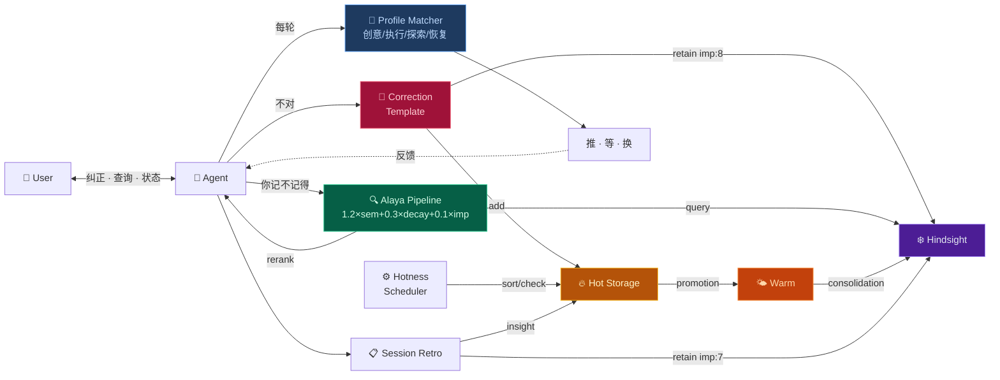

# Dopagent

AI 助手自我学习框架。Alaya 检索重排 + 三层记忆 + 纠正自动学习 + Dopagent 动机引擎。

[繁體中文](README_ZH-TW.md) · [English](README_EN.md)

---

## 架构层次 / Architecture Layers

安装后你处在 **L1**。L0-L3 自动运行，L4-L5 等数据积累后自动激活。

| 层 | 名称 | 状态 | 触发方式 |
|---|---|---|---|
| **L0** | 基础设施 · Alaya 管道 + 热存储 + 冷存储 | ✅ 自动 | 安装即运行 |
| **L1** | 安装引导 · install.py + 六平台移植 | ✅ 自动 | `python install.py` |
| **L2** | Dopagent Check · 状态感知 + λ 监控 | ✅ 自动 | 每轮回复前自动执行 |
| **L3** | 执行层 · 四模式切换 + 吸引力提议 | ✅ 自动 | Dopagent Check 触发 |
| **L4** | 模式提炼 · 教训→泛化 | 🚧 等数据 | 积累 50+ 纠正后自动激活 |
| **L5** | 元学习 · 符号蒸馏 + 审计 + 安全栅 | 📐 规范就绪 | 等 L4 产出后自动激活 |

**可选增强**（需手动开启）：

| 功能 | 说明 | 开启方式 |
|---|---|---|
| 纠正验证 | 调廉价 LLM 复查纠正提取是否准确 | 说 "开启纠正验证" |
| Engagement 信号 | 检测你对某个话题的持续兴趣 | 说 "开启 engagement 检测" |

→ [完整拓扑图 + 完成度](ROADMAP.md)

---

---

## 这个 Skill 能做什么

你的 AI 助手每次被你纠正之后，自动把教训存进长期记忆。下次遇到类似的场景，最相关的经验自己浮上来——不靠运气，靠一套检索重排算法。

记性好了还不够。它得知道**什么时候该推你一把、什么时候该闭嘴**。Dopagent 有四个模式——创意、执行、探索、恢复——根据你的状态自己切。深夜还在兴奋地聊架构？切创意模式，不催你。连着三轮说"不想动"？切恢复模式，只给一个 30 秒的微选项，不做任何 push。

全部跑在本地。Python 标准库，零外部依赖。装好之后你纠正 Agent 的那一刻，整个学习管道就开始转了。

## 为什么叫 Dopagent

我有 ADHD。

多巴胺是我的操作系统。一个任务能不能被启动，跟它重不重要没关系——跟它**有没有意思**有关系。无聊的事沉下去，刺激的事浮上来。不是懒，是大脑的调度算法跟别人不一样。

这个框架的动机引擎就是照着这套逻辑建的：

- **热存储** = 你脑子的工作台。感兴趣的事自动浮到最上面，不感兴趣的慢慢降温沉底。不是删掉——是暂时不在你眼前碍事。
- **冷存储** = 长期记忆。真正重要的东西固化进去，但不会被"现在觉得好玩"的东西污染。
- **纠正即学习** = 你说"不对，应该是 X 不是 Y"——这就是最强的学习信号。不需要专门说"记下来"。纠正本身就是"记下来"。
- **四个 profile** = ADHD 不是只有一种状态。深夜 hyperfocus 和白天碎片时间的认知模式完全不同。Agent 得学会分清楚。

说白了：我给我的 AI 助手加了一层外部前额叶。它不能治好 ADHD，但它能在我忘了的时候替我记得、在我卡住的时候帮我识别"现在该换道了"、在我想做事的时候把最该做的事放在我眼前。

## 前置条件

| 依赖 | 必需 | 说明 |
|---|---|---|
| Python 3.10+ | ✅ | 全部标准库，无需 pip install |
| curl | ✅ | HTTP 调用 Hindsight API |
| Hindsight daemon | ✅ | 长期记忆存储，默认 :9177 |
| HanaAgent | ✅ | Skill 加载 + Pinned Memory + Agent 宿主 |
| 5 分钟 | ✅ | 改两个路径 + 跑一条命令 |

各脚本的依赖清单：

```
scripts/
  alaya_rerank.py   → json, math, datetime, sys      (stdlib only)
  alaya_recall.py   → json, subprocess, tempfile, sys  (stdlib only)
  hotness.py        → json, pathlib, re, datetime, sys (stdlib only)

系统工具: curl（调用 Hindsight HTTP API）
```

**开发与验证环境**：Windows 11 · HanaAgent · Hindsight

## 快速开始

```bash
# 1. 编辑配置——只需改两个路径
cp config.example.py config.py
# 打开 config.py，设置 WORKSPACE 和 SKILLS_DIR

# 2. 安装
python install.py

# 3. 引导 Agent
# 在 HanaAgent 新会话中说：
# "加载 dopagent skill"
#
# Agent 会自动完成 bootstrap——pin instincts、验证管道。
```

## 包含什么

```
安装后 Agent 获得三项新能力：

· 纠正我 → 自动提取教训，存入长期记忆，下次不再犯
· "你记不记得" → Alaya 公式重排，最相关的记忆排最前面
· 热存储 → 短期高频记忆自动管理，该浮的浮、该沉的沉

Dopagent 动机引擎（可选激活）：
· 四个模式自动切换——创意 / 执行 / 探索 / 恢复
· Agent 感知你的状态，决定该推、该等、还是该换方向
```

## 架构



## 许可

MIT

## 致谢

- **Alaya 检索公式**（1.2×semantic + 0.3×time_decay + 0.1×emotion）  
  源自 [moeru-ai/airi](https://github.com/moeru-ai/airi) 项目（MIT）的  
  [Alaya 记忆层提案](https://github.com/moeru-ai/airi/issues/879)（@lvy010, 2026-01-05）
- **Dopagent 动机引擎** — Instincts 概念启发自 [ECC](https://github.com/affaan-m/ECC)（MIT）
- **符号蒸馏记法** — 参考 [TencentDB Agent Memory](https://github.com/TencentCloud/TencentDB-Agent-Memory) 的符号化压缩思路
- **Hindsight** — 长期记忆后端（MIT）
- **Alaya 命名** — 梵语 *ālaya-vijñāna*（阿赖耶识），亦见于 [SecurityRonin/alaya](https://github.com/SecurityRonin/alaya)（MIT）

→ [移植到其他平台](PORTING.md)
→ [架构快照](ROADMAP.md)
