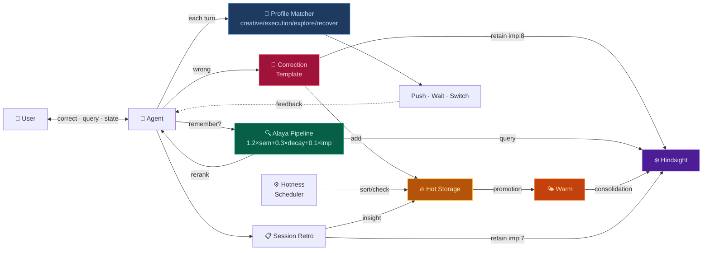

# Dopagent

An AI agent that learns from your corrections — Alaya retrieval rerank, 3-tier memory, correction autolearn, and ADHD-optimized motivation engine.

[简体中文](README.md) · [繁體中文](README_ZH-TW.md)

---

## Architecture Layers / 架构层次

After installation you're at **L1**. L0-L3 run automatically. L4-L5 activate when enough data accumulates.

| Layer | Name | Status | Trigger |
|---|---|---|---|
| **L0** | Infrastructure · Alaya + Hot/Cold Storage | ✅ Auto | Runs on install |
| **L1** | Bootstrap · install.py + 6-platform porting | ✅ Auto | `python install.py` |
| **L2** | Dopagent Check · State sensing + λ monitor | ✅ Auto | Every response |
| **L3** | Execution · 4 profiles + Propose | ✅ Auto | Triggered by L2 |
| **L4** | Pattern Extraction · Lesson → Generalization | 🚧 Needs data | Auto after 50+ corrections |
| **L5** | Meta-Learning · Symbolic Distill + Audit | 📐 Spec ready | Auto after L4 output |

**Optional** (manual opt-in):

| Feature | Description | How to enable |
|---|---|---|
| Correction Verify | Cheap LLM double-checks extracted lessons | Say "开启纠正验证" / "enable correction verify" |
| Engagement Signal | Detects sustained interest in a topic | Say "开启 engagement 检测" / "enable engagement detection" |

→ [Full topology + completion status](ROADMAP.md)

---

## Quick Start

```bash
# 1. Configure — just two paths to edit
cp config_example.py config.py
# Open config.py, set WORKSPACE and SKILLS_DIR

# 2. Install
python install.py

# 3. Bootstrap the Agent
# In a new HanaAgent session, say:
# "load dopagent skill"
#
# The Agent will self-bootstrap — pin instincts, verify the pipeline.
```

## 5-Minute Walkthrough

After install, try this — see all four circuits in action:

```
👤 User:   "Toronto is in Ontario, not Quebec."
           (← a correction, but you didn't say "remember this")

🤖 Agent:  Detects correction signal → auto-fills template:

           Correction Template:
           · I was wrong: confused province
           · Correct: Toronto = Ontario
           · Next time: verify Canadian geography first

           → retain to Hindsight (imp:8)
           → add to Hot Storage [correction]
           → hotness.py sort → floats to ACTIVE top

👤 User:   (3 days later) "Did I correct you about geography before?"

🤖 Agent:  python alaya_recall.py "geography correction"
           → Alaya formula: semantic + time decay + importance
           → "Toronto in Ontario" ranks #1
           → "Yes, on July 13 you corrected me about Toronto."
```

Four circuits, one flow: correction → storage → retrieval → hot storage lifecycle.

---

## What This Skill Does

Your AI agent automatically extracts lessons from every correction and stores them in long-term memory. Next time a similar scenario comes up, the most relevant experience surfaces — not by luck, by a retrieval algorithm.

Memory alone isn't enough. The agent also needs to know **when to nudge you and when to stay quiet**. Dopagent runs four profiles — creative, execution, exploration, recovery — switching based on your state.

Everything runs locally. Python stdlib, zero external dependencies.

> ⚠️ Dopagent Check is an LLM reasoning step — the agent makes a best effort each turn, but there is no program-level enforcement. The framework's reliability comes from the correction loop (correct→retain→Alaya recall). The motivation engine is an assistive layer.

## Why "Dopagent"

I have ADHD. Dopamine is my operating system. A task doesn't get started because it's important — it gets started because it's *interesting*. The boring stuff sinks. The stimulating stuff floats.

- **Hot storage** = your brain's workbench. Interesting floats; uninteresting sinks
- **Cold storage** = long-term memory. Important stays; fun-of-the-moment doesn't pollute it
- **Correction as learning** = "No, it should be X not Y" — the strongest learning signal
- **Four profiles** = ADHD is not one state. Late-night hyperfocus ≠ scattered daytime attention

Put simply: an external prefrontal cortex for your AI assistant.

## Prerequisites

| Dependency | Required | Notes |
|---|---|---|
| Python 3.10+ | ✅ | stdlib only — no pip install |
| curl | ✅ | HTTP calls to Hindsight API |
| Hindsight daemon | ✅ | Long-term memory backend, default :9177 |
| HanaAgent | ✅ | Skill loading + Pinned Memory + Agent runtime |
| 5 minutes | ✅ | Edit two paths + run one command |

```
scripts/
  alaya_rerank.py   → json, math, datetime, sys      (stdlib only)
  alaya_recall.py   → json, subprocess, tempfile, sys  (stdlib only)
  hotness.py        → json, pathlib, re, datetime, sys (stdlib only)

System: curl (Hindsight HTTP API)
```

**Dev & Test Environment**: Windows 11 · HanaAgent · Hindsight

## Architecture



## License

MIT

## Acknowledgments

- **Alaya retrieval formula** (1.2×semantic + 0.3×time_decay + 0.1×emotion)  
  From [moeru-ai/airi](https://github.com/moeru-ai/airi) (MIT) —  
  [Alaya memory layer proposal](https://github.com/moeru-ai/airi/issues/879) by @lvy010 (2026-01-05)
- **Dopagent motivation engine** — Instincts concept inspired by [ECC](https://github.com/affaan-m/ECC) (MIT)
- **Symbolic distillation notation** — Adapted from [TencentDB Agent Memory](https://github.com/TencentCloud/TencentDB-Agent-Memory)
- **Hindsight** — Long-term memory backend (MIT)
- **Alaya naming** — Sanskrit *ālaya-vijñāna* (storehouse consciousness), also used by [SecurityRonin/alaya](https://github.com/SecurityRonin/alaya) (MIT)

→ [Porting to other platforms](PORTING.md)
→ [Architecture overview](ROADMAP.md)

## Glossary

| Term | One-liner |
|---|---|
| Hindsight | Local long-term memory service (port 9177). Stores corrections and mental models |
| Alaya | Retrieval rerank script — ranks memories by semantic similarity + time decay + importance |
| Hot Storage | `hot_memory.md` — short-term high-frequency memory, auto floats and sinks |
| Warm Storage | Repeatedly validated patterns, pending promotion to long-term 🚧 planned |
| λ (lambda) | Time decay coefficient, controls memory cooldown speed |

## FAQ

**Q: Nothing happens after install?**  
A: Check Hindsight is running: `curl http://127.0.0.1:9177/health`. Start the Hindsight daemon if it's not.

**Q: Recall times out?**  
A: Hindsight's local embedding model is slow on first query (30-90s). Subsequent queries are faster. If it keeps timing out, check if Hindsight is overloaded by other processes.

**Q: Do I need to understand Hindsight or Alaya?**  
A: No. Correct the agent → auto-learning. The internals are transparent in daily use.

**Q: When will correction verify / engagement detection be available?**  
A: 🚧 Design complete, implementation pending. The core loop (correct→retain→Alaya recall) is fully functional now.

## Planned

| Feature | Status |
|---|---|
| Warm storage promotion (hot→warm) | 📐 Designed, `hotness.py promote` pending |
| Correction verify (verify.py) | 📐 Designed, pending |
| Engagement signal | 📐 Designed, pending |
| Cross-platform install scripts | 📐 PORTING.md covers, `install-{platform}.sh` pending |
