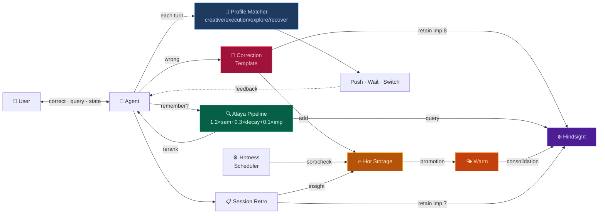

# Dopagent

An AI agent that learns from your corrections — Alaya retrieval rerank, 3-tier memory, correction autolearn, and ADHD-optimized motivation engine.

[简体中文](README.md) · [繁體中文](README_ZH-TW.md)

---

## Architecture Layers / 架构层次

After installation you're at **L1**. L0-L3 run automatically. L4-L5 activate when enough data accumulates.

| Layer | Name | Status | Trigger |
|---|---|---|---|
| **L0** | Infrastructure · Alaya + Hot/Cold Storage | ✅ Auto | Runs on install |
| **L1** | Bootstrap · install.py + 6-platform porting | ✅ Auto | `python install.py` |
| **L2** | Dopagent Check · State sensing + λ monitor | ✅ Auto | Every response |
| **L3** | Execution · 4 profiles + Propose | ✅ Auto | Triggered by L2 |
| **L4** | Pattern Extraction · Lesson → Generalization | 🚧 Needs data | Auto after 50+ corrections |
| **L5** | Meta-Learning · Symbolic Distill + Audit | 📐 Spec ready | Auto after L4 output |

**Optional** (manual opt-in):

| Feature | Description | How to enable |
|---|---|---|
| Correction Verify | Cheap LLM double-checks extracted lessons | Say "enable correction verify" |
| Engagement Signal | Detects sustained interest in a topic | Say "enable engagement detection" |

→ [Full topology + completion status](ROADMAP.md)

---

---

## What This Skill Does

Every time you correct your AI agent, it extracts the lesson, stores it in long-term memory, and surfaces it the next time it's relevant. Not by chance — by a retrieval algorithm that weights semantic similarity, recency, and importance.

Memory alone isn't enough. The agent also needs to know **when to nudge you and when to stay quiet**. Dopagent runs four profiles — creative, execution, exploration, recovery — and switches between them based on your conversational state. Deep in architecture discussion at 2 AM? Creative mode. Said "I don't feel like doing anything" three times in a row? Recovery mode — a single 30-second micro-option, zero pressure.

Everything runs locally. Python stdlib, zero external dependencies. The learning pipeline starts the moment you correct the agent.

> ⚠️ Dopagent Check is an LLM reasoning step — the agent makes a best effort each turn, but there is no program-level enforcement. The framework's reliability comes from the correction loop (correct→retain→Alaya recall). The motivation engine is an assistive layer.

## Why "Dopagent"

I have ADHD.

Dopamine is my operating system. A task doesn't get started because it's important — it gets started because it's *interesting*. The boring stuff sinks. The stimulating stuff floats. It's not laziness. It's a different scheduling algorithm.

This framework's motivation engine is built on exactly that logic:

- **Hot storage** = your brain's workbench. Interesting things float to the top. Uninteresting things slowly cool down and sink. They're not deleted — just not in your face right now.
- **Cold storage** = long-term memory. The truly important stuff crystallizes there, uncontaminated by whatever feels fun in the moment.
- **Correction as learning** = when you say "no, it should be X not Y" — that's the strongest learning signal there is. No need to explicitly say "remember this." The correction *is* the "remember this."
- **Four profiles** = ADHD is not one state. Late-night hyperfocus and scattered daytime attention are completely different cognitive modes. The agent has to learn the difference.

Put simply: I gave my agent an external prefrontal cortex. It won't cure ADHD. But it remembers things when I forget, recognizes when I'm stuck and need to pivot, and puts the most important task in front of me when I'm actually ready to do it.

## Prerequisites

| Dependency | Required | Notes |
|---|---|---|
| Python 3.10+ | ✅ | stdlib only — no pip install needed |
| curl | ✅ | HTTP calls to Hindsight API |
| Hindsight daemon | ✅ | Long-term memory backend, default :9177 |
| HanaAgent | ✅ | Skill loading + Pinned Memory + Agent runtime |
| 5 minutes | ✅ | Edit two paths + run one command |

Zero external Python dependencies:

```
scripts/
  alaya_rerank.py   → json, math, datetime, sys      (stdlib only)
  alaya_recall.py   → json, subprocess, tempfile, sys  (stdlib only)
  hotness.py        → json, pathlib, re, datetime, sys (stdlib only)

System: curl (Hindsight HTTP API)
```

**Dev & Test Environment**: Windows 11 · HanaAgent · Hindsight

## Quick Start

```bash
# 1. Configure — just two paths to edit
cp config_example.py config.py
# Open config.py, set WORKSPACE and SKILLS_DIR

# 2. Install
python install.py

# 3. Bootstrap the Agent
# In a new HanaAgent session, say:
# "load dopagent skill"
#
# The Agent will self-bootstrap — pin instincts, verify the pipeline.
```

## 5-Minute Walkthrough

After install, try this — see all four circuits in action:

```
👤 User:   "Shenzhen is in Guangdong, not Guangxi."
           (← a correction, but you didn't say "remember this")

🤖 Agent:  Detects correction signal → auto-fills template:

           Correction Template:
           · I was wrong: confused province
           · Correct: Shenzhen = Guangdong city
           · Next time: verify Chinese geography first

           → retain to Hindsight (imp:8)
           → add to Hot Storage [correction]
           → hotness.py sort → floats to ACTIVE top

👤 User:   (3 days later) "Did I correct you about geography before?"

🤖 Agent:  python alaya_recall.py "geography correction"
           → Alaya formula: semantic + time decay + importance
           → "Shenzhen in Guangdong" ranks #1
           → "Yes, on July 13 you corrected me about Shenzhen."
```

Four circuits, one flow: correction → storage → retrieval → hot storage lifecycle.

```
Three new Agent capabilities:

· Correct the Agent → lessons auto-extracted, stored in long-term memory
· "Do you remember..." → Alaya rerank surfaces the most relevant memories
· Hot storage → short-term high-frequency memory auto-managed (float / sink)

Dopagent motivation engine (opt-in):
· Four profiles — creative / execution / exploration / recovery
· Agent senses your state, decides whether to push, wait, or pivot
```

## Architecture



## Portability

→ [Porting to other platforms](PORTING.md) — Claude Code, Cursor, Copilot, Codex, Windsurf, OpenClaw

## Roadmap

→ [Architecture overview](ROADMAP.md) — completion status and next priorities

## License

MIT

## Acknowledgments

- **Alaya retrieval formula** (1.2×semantic + 0.3×time_decay + 0.1×emotion)  
  From [moeru-ai/airi](https://github.com/moeru-ai/airi) (MIT) —  
  [Alaya memory layer proposal](https://github.com/moeru-ai/airi/issues/879) by @lvy010 (2026-01-05)
- **Dopagent motivation engine** — Instincts concept inspired by [ECC](https://github.com/affaan-m/ECC) (MIT)
- **Symbolic distillation notation** — Adapted from [TencentDB Agent Memory](https://github.com/TencentCloud/TencentDB-Agent-Memory)
- **Hindsight** — Long-term memory backend (MIT)
- **Alaya naming** — Sanskrit *ālaya-vijñāna* (storehouse consciousness), also used by [SecurityRonin/alaya](https://github.com/SecurityRonin/alaya) (MIT)
