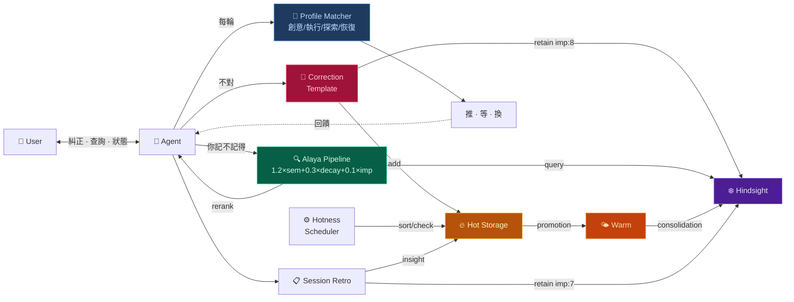

# Dopagent

AI 助手自我學習框架。Alaya 檢索重排 + 三層記憶 + 糾正自動學習 + Dopagent 動機引擎。

[简体中文](README.md) · [English](README_EN.md)

---

## 架構層次 / Architecture Layers

安裝後你處在 **L1**。L0-L3 自動運行，L4-L5 等數據積累後自動啟動。

| 層 | 名稱 | 狀態 | 觸發方式 |
|---|---|---|---|
| **L0** | 基礎設施 · Alaya 管道 + 熱存儲 + 冷存儲 | ✅ 自動 | 安裝即運行 |
| **L1** | 安裝引導 · install.py + 六平台移植 | ✅ 自動 | `python install.py` |
| **L2** | Dopagent Check · 狀態感知 + λ 監控 | ✅ 自動 | 每輪回覆前自動執行 |
| **L3** | 執行層 · 四模式切換 + 吸引力提議 | ✅ 自動 | Dopagent Check 觸發 |
| **L4** | 模式提煉 · 教訓→泛化 | 🚧 等數據 | 累積 50+ 糾正後自動啟動 |
| **L5** | 元學習 · 符號蒸餾 + 審計 + 安全柵 | 📐 規範就緒 | 等 L4 產出後自動啟動 |

**可選增強**（需手動開啟）：

| 功能 | 說明 | 開啟方式 |
|---|---|---|
| 糾正驗證 | 調廉價 LLM 複查糾正提取是否準確 | 說「開啟糾正驗證」 |
| Engagement 信號 | 檢測你對某個話題的持續興趣 | 說「開啟 engagement 檢測」 |

→ [完整拓撲圖 + 完成度](ROADMAP.md)

---

---

## 這個 Skill 能做什麼

你的 AI 助手每次被你糾正之後，自動把教訓存進長期記憶。下次遇到類似的場景，最相關的經驗自己浮上來——不靠運氣，靠一套檢索重排演算法。

記性好了還不夠。它得知道**什麼時候該推你一把、什麼時候該閉嘴**。Dopagent 有四個模式——創意、執行、探索、恢復——根據你的狀態自己切。深夜還在興奮地聊架構？切創意模式，不催你。連著三輪說「不想動」？切恢復模式，只給一個 30 秒的微選項，不做任何 push。

全部跑在本地。Python 標準庫，零外部依賴。裝好之後你糾正 Agent 的那一刻，整個學習管道就開始轉了。

## 為什麼叫 Dopagent

我有 ADHD。

多巴胺是我的作業系統。一個任務能不能被啟動，跟它重不重要沒關係——跟它**有沒有意思**有關係。無聊的事沉下去，刺激的事浮上來。不是懶，是大腦的排程演算法跟別人不一樣。

這個框架的動機引擎就是照著這套邏輯建的：

- **熱儲存** = 你腦子的工作檯。感興趣的事自動浮到最上面，不感興趣的慢慢降溫沉底。不是刪掉——是暫時不在你眼前礙事。
- **冷儲存** = 長期記憶。真正重要的東西固化進去，但不會被「現在覺得好玩」的東西污染。
- **糾正即學習** = 你說「不對，應該是 X 不是 Y」——這就是最強的學習訊號。不需要專門說「記下來」。糾正本身就是「記下來」。
- **四個 profile** = ADHD 不是只有一種狀態。深夜 hyperfocus 跟白天碎片時間的認知模式完全不同。Agent 得學會分清楚。

說白了：我給我的 AI 助手加了一層外部前額葉。它不能治好 ADHD，但它能在我忘了的時候替我記得、在我卡住的時候幫我識別「現在該換道了」、在我想做事的時候把最該做的事放在我眼前。

## 前置條件

| 依賴 | 必需 | 說明 |
|---|---|---|
| Python 3.10+ | ✅ | 全部標準庫，無需 pip install |
| curl | ✅ | HTTP 呼叫 Hindsight API |
| Hindsight daemon | ✅ | 長期記憶儲存，預設 :9177 |
| HanaAgent | ✅ | Skill 載入 + Pinned Memory + Agent 宿主 |
| 5 分鐘 | ✅ | 改兩個路徑 + 跑一條命令 |

各腳本的依賴清單：

```
scripts/
  alaya_rerank.py   → json, math, datetime, sys      (stdlib only)
  alaya_recall.py   → json, subprocess, tempfile, sys  (stdlib only)
  hotness.py        → json, pathlib, re, datetime, sys (stdlib only)

系統工具: curl（呼叫 Hindsight HTTP API）
```

**開發與驗證環境**：Windows 11 · HanaAgent · Hindsight

## 快速開始

```bash
# 1. 編輯設定——只需改兩個路徑
cp config_example.py config.py
# 打開 config.py，設定 WORKSPACE 和 SKILLS_DIR

# 2. 安裝
python install.py

# 3. 引導 Agent
# 在 HanaAgent 新對話中說：
# "載入 dopagent skill"
#
# Agent 會自動完成 bootstrap——pin instincts、驗證管道。
```

## 包含什麼

```
安裝後 Agent 獲得三項新能力：

· 糾正我 → 自動提取教訓，存入長期記憶，下次不再犯
· 「你記不記得」→ Alaya 公式重排，最相關的記憶排最前面
· 熱儲存 → 短期高頻記憶自動管理，該浮的浮、該沉的沉

Dopagent 動機引擎（可選啟用）：
· 四個模式自動切換——創意 / 執行 / 探索 / 恢復
· Agent 感知你的狀態，決定該推、該等、還是該換方向
```

## 架構



## 許可

MIT

## 致謝

- **Alaya 檢索公式**（1.2×semantic + 0.3×time_decay + 0.1×emotion）  
  源自 [moeru-ai/airi](https://github.com/moeru-ai/airi) 專案（MIT）的  
  [Alaya 記憶層提案](https://github.com/moeru-ai/airi/issues/879)（@lvy010, 2026-01-05）
- **Dopagent 動機引擎** — Instincts 概念啟發自 [ECC](https://github.com/affaan-m/ECC)（MIT）
- **符號蒸餾記法** — 參考 [TencentDB Agent Memory](https://github.com/TencentCloud/TencentDB-Agent-Memory) 的符號化壓縮思路
- **Hindsight** — 長期記憶後端（MIT）
- **Alaya 命名** — 梵語 *ālaya-vijñāna*（阿賴耶識），亦見於 [SecurityRonin/alaya](https://github.com/SecurityRonin/alaya)（MIT）

→ [移植到其他平台](PORTING.md)
→ [架構快照](ROADMAP.md)
