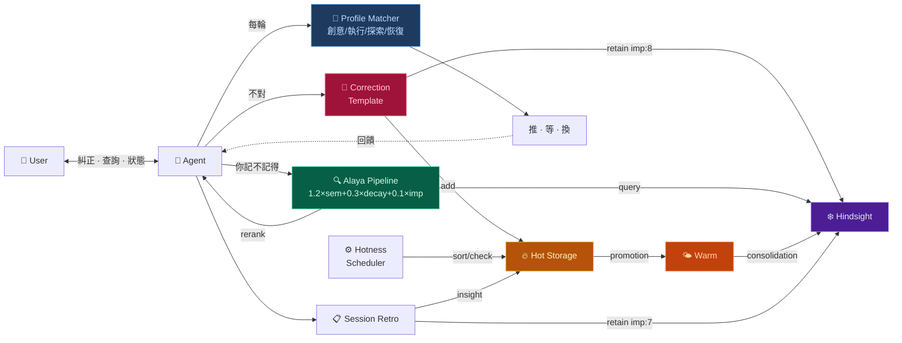

# Dopagent

AI 助手自我學習框架。Alaya 檢索重排 + 三層記憶 + 糾正自動學習 + Dopagent 動機引擎。

[简体中文](README.md) · [English](README_EN.md)

---

## 架構層次 / Architecture Layers

安裝後你處在 **L1**。L0-L3 自動運行，L4-L5 等數據積累後自動啟動。

| 層 | 名稱 | 狀態 | 觸發方式 |
|---|---|---|---|
| **L0** | 基礎設施 · Alaya 管道 + 熱儲存 + 冷儲存 | ✅ 自動 | 安裝即運行 |
| **L1** | 安裝引導 · install.py + 六平台移植 | ✅ 自動 | `python install.py` |
| **L2** | Dopagent Check · 狀態感知 + λ 監控 | ✅ 自動 | 每輪回覆前自動執行 |
| **L3** | 執行層 · 四模式切換 + 吸引力提議 | ✅ 自動 | Dopagent Check 觸發 |
| **L4** | 模式提煉 · 教訓→泛化 | 🚧 等數據 | 累積 50+ 糾正後自動啟動 |
| **L5** | 元學習 · 符號蒸餾 + 審計 + 安全柵 | 📐 規範就緒 | 等 L4 產出後自動啟動 |

**可選增強**（需手動開啟）：

| 功能 | 說明 | 開啟方式 |
|---|---|---|
| 糾正驗證 | 調廉價 LLM 複查糾正提取是否準確 | 說「開啟糾正驗證」/ \"enable correction verify\" |
| Engagement 信號 | 檢測你對某個話題的持續興趣 | 說「開啟 engagement 檢測」/ \"enable engagement detection\" |

→ [完整拓撲圖 + 完成度](ROADMAP.md)

---

## 快速開始

```bash
# 1. 編輯設定——只需改兩個路徑
cp config_example.py config.py
# 打開 config.py，設定 WORKSPACE 和 SKILLS_DIR

# 2. 安裝
python install.py

# 3. 引導 Agent
# 在 HanaAgent 新對話中說：
# 「載入 dopagent skill」
#
# Agent 會自動完成 bootstrap——pin instincts、驗證管道。
```

## 5 分鐘 Walkthrough

裝好之後，試試這個——最直觀地感受框架怎麼運轉：

```
👤 User：  "台南在台灣南部，不在北部。"
           （← 這是一條糾正，但沒顯式說「記住」）

🤖 Agent： 檢測到糾正訊號 → 自動填模板：

           糾正模板：
           · 我錯了：混淆了台灣城市位置
           · 正確：台南在南部
           · 下次：涉及台灣地理先確認位置

           → retain 到 Hindsight（imp:8）
           → 寫入熱儲存 [correction]
           → hotness.py sort → 這條浮到 ACTIVE 區頂部

👤 User：  （三天後）"我之前是不是糾正過你一個地理問題？"

🤖 Agent： python alaya_recall.py "地理 糾正"
           → Alaya 公式：語義相似度 + 時間衰減 + 重要性 三重加權
           → "台南在南部" 排第一
           → "是的，你糾正過我台南在南部不在北部。"
```

四條回路一次跑通：糾正學習 → 記憶儲存 → 檢索重排 → 熱儲存生命週期。

---

## 這個 Skill 能做什麼

你的 AI 助手每次被你糾正之後，自動把教訓存進長期記憶。下次遇到類似的場景，最相關的經驗自己浮上來——不靠運氣，靠一套檢索重排演算法。

記性好了還不夠。它得知道**什麼時候該推你一把、什麼時候該閉嘴**。Dopagent 有四個模式——創意、執行、探索、恢復——根據你的狀態自己切。深夜還在興奮地聊架構？切創意模式，不催你。連著三輪說「不想動」？切恢復模式，只給一個 30 秒的微選項，不做任何 push。

全部跑在本地。Python 標準庫，零外部依賴。

> ⚠️ Dopagent Check 是 LLM 推理步驟——Agent 每輪盡力執行，但無程式級強制保障。框架的可靠性在糾正閉環（糾正→retain→Alaya 召回）上，動機引擎是輔助層。

## 為什麼叫 Dopagent

我有 ADHD。多巴胺是我的作業系統。一個任務能不能被啟動，跟它重不重要沒關係——跟它**有沒有意思**有關係。無聊的事沉下去，刺激的事浮上來。

- **熱儲存** = 你腦子的工作檯。感興趣的浮上來，不感興趣的沉底
- **冷儲存** = 長期記憶。重要的固化進去，不被「現在覺得好玩」的東西污染
- **糾正即學習** = 「不對，應該是 X 不是 Y」——最強的學習訊號
- **四個 profile** = ADHD 不是只有一種狀態。深夜 hyperfocus 和白天碎片時間完全不同

說白了：給 AI 助手加了一層外部前額葉。

## 前置條件

| 依賴 | 必需 | 說明 |
|---|---|---|
| Python 3.10+ | ✅ | 全部標準庫，無需 pip install |
| curl | ✅ | HTTP 呼叫 Hindsight API |
| Hindsight daemon | ✅ | 長期記憶儲存，預設 :9177 |
| HanaAgent | ✅ | Skill 載入 + Pinned Memory + Agent 宿主 |
| 5 分鐘 | ✅ | 改兩個路徑 + 跑一條命令 |

```
scripts/
  alaya_rerank.py   → json, math, datetime, sys      (stdlib only)
  alaya_recall.py   → json, subprocess, tempfile, sys  (stdlib only)
  hotness.py        → json, pathlib, re, datetime, sys (stdlib only)

系統工具: curl（呼叫 Hindsight HTTP API）
```

**開發與驗證環境**：Windows 11 · HanaAgent · Hindsight

## 架構



## 許可

MIT

## 致謝

- **Alaya 檢索公式**（1.2×semantic + 0.3×time_decay + 0.1×emotion）  
  源自 [moeru-ai/airi](https://github.com/moeru-ai/airi) 專案（MIT）的  
  [Alaya 記憶層提案](https://github.com/moeru-ai/airi/issues/879)（@lvy010, 2026-01-05）
- **Dopagent 動機引擎** — Instincts 概念啟發自 [ECC](https://github.com/affaan-m/ECC)（MIT）
- **符號蒸餾記法** — 參考 [TencentDB Agent Memory](https://github.com/TencentCloud/TencentDB-Agent-Memory) 的符號化壓縮思路
- **Hindsight** — 長期記憶後端（MIT）
- **Alaya 命名** — 梵語 *ālaya-vijñāna*（阿賴耶識），亦見於 [SecurityRonin/alaya](https://github.com/SecurityRonin/alaya)（MIT）

→ [移植到其他平台](PORTING.md)
→ [架構快照](ROADMAP.md)

## 詞彙表

| 術語 | 一句話 |
|---|---|
| Hindsight | 本地運行的長期記憶服務（埠 9177），存糾正記錄和心智模型 |
| Alaya | 檢索重排腳本——按「語義相似度+時間衰減+重要性」排序記憶 |
| 熱儲存 | `hot_memory.md`——短期高頻記憶，自動浮沉 |
| 溫儲存 | 被多次驗證的規律，待提煉為長期模式 🚧 規劃中 |
| λ (lambda) | 時間衰減係數，控制記憶降溫速度 |

## 常見問題

**Q: 裝完沒有任何反應？**  
A: 檢查 Hindsight 是否運行：`curl http://127.0.0.1:9177/health`。沒啟動就先啟動 Hindsight daemon。

**Q: recall 逾時？**  
A: Hindsight 的本地嵌入模型首次查詢較慢（30-90 秒）。後續查詢會快一些。如果持續逾時，檢查 Hindsight 是否負載過高（是否有其他程序在大量讀寫）。

**Q: 我需要理解 Hindsight 或 Alaya 的原理嗎？**  
A: 不需要。糾正 Agent → 自動學習。原理對日常使用透明。

**Q: 糾正驗證 / Engagement 檢測什麼時候能用？**  
A: 🚧 規劃設計完成，程式碼待實作。當前核心迴路（糾正→retain→Alaya 召回）已完整可用。

## 規劃中

| 功能 | 狀態 |
|---|---|
| 溫儲存提煉（hot→warm） | 📐 設計完成，`hotness.py promote` 待實作 |
| 糾正驗證（verify.py） | 📐 設計完成，待實作 |
| Engagement 信號 | 📐 設計完成，待實作 |
| 跨平台安裝腳本 | 📐 PORTING.md 已覆蓋，`install-{platform}.sh` 待實作 |
