# Dopagent · Architecture Overview / 架构快照

## Architecture Topology / 架构拓扑

```mermaid
graph TD
    subgraph L5["L5 · Meta-Learning / 元学习"]
        AUDIT["Audit Engine 审计引擎"]
        DISTILL["Symbolic Distill 符号蒸馏"]
        SAFETY["Safety Gates 安全栅"]
    end

    subgraph L4["L4 · Pattern Extraction / 模式提炼"]
        HOT2WARM["Hot → Warm 热→温"]
        WARM2COLD["Warm → Cold 温→冷"]
        GENERALIZE["Generalize 泛化"]
    end

    subgraph L3["L3 · Execution / 执行层"]
        PROFILES["4 Profiles 四模式"]
        PROPOSE["Propose 吸引力提议"]
        SWITCH["Auto Switch 自动切换"]
    end

    subgraph L2["L2 · Dopagent Check / 动机检测"]
        DCHECK["Dopagent Check 状态感知"]
        LAMBDA["λ Monitor 衰减监控"]
        SIGNALS["Signal Detectors 信号检测"]
    end

    subgraph L1["L1 · Bootstrap / 安装引导"]
        INSTALL["install.py"]
        SKILL["SKILL.md"]
        CONFIG["config_example.py"]
        PORTING["PORTING.md 6 platforms"]
    end

    subgraph L0["L0 · Infrastructure / 基础设施"]
        ALAYA["Alaya Pipeline 检索管道"]
        HOT["Hot Storage 热存储"]
        COLD["Hindsight 冷存储"]
        TEMPLATE["Correction Template 纠正模板"]
    end

    subgraph EXT["External / 外部依赖"]
        HINDSIGHT["Hindsight API :9177"]
        HANA["HanaAgent"]
        CURL["curl"]
    end

    L0 --> L1 --> L2 --> L3 --> L4 --> L5
    ALAYA --> HINDSIGHT
    COLD --> HINDSIGHT
    SKILL --> HANA
    DCHECK --> HOT
    PROFILES --> PROPOSE
    HOT2WARM --> GENERALIZE
    GENERALIZE --> AUDIT
    AUDIT --> DISTILL
    SAFETY --> SKILL

    style L0 fill:#1a3a1a,stroke:#4a4
    style L1 fill:#1a3a1a,stroke:#4a4
    style L2 fill:#1a3a1a,stroke:#4a4
    style L3 fill:#1a3a1a,stroke:#4a4
    style L4 fill:#2a2a1a,stroke:#aa4
    style L5 fill:#2a1a2a,stroke:#a4a
    style EXT fill:#1a2a3a,stroke:#48a
```



## Completion Status / 完成度总览

```
Self-Learning Loop / 自我学习闭环      ████████████████░░░░  80%
 ① Detect / 检测                      ████████   correction signal ✅
 ② Diagnose / 诊断                    ████████   correction template pinned ✅
 ③ Write / 写入                       ████████   Hindsight retain ✅
 ④ Retrieve / 检索                    ████████   Alaya pipeline ✅
 ⑤ Generalize / 泛化                  ██░░░░░░   needs 50+ corrections
 ⑥ Meta-learn / 元学习                📐         L5_SPEC.md 设计完成

3-Tier Memory / 三层记忆              ██████████████░░░░  70%
 Hot / 热存储                         ████████   hot_memory.md + hotness.py ✅
 Warm / 温存储                        ░░░░░░░░   designed, pending implementation
 Cold / 冷存储                        ████████   Hindsight + Alaya ✅

Dopagent Engine / 动机引擎             ██████████████░░░░  70%
 Profiles (4 modes)                   ████████   ✅ embedded in SKILL.md
 Propose template                     ████████   ✅ embedded in SKILL.md
 Profile switching                    ████████   ✅ Dopagent Check auto-switch
 Signals (engagement/surfacing)       ░░░░░░░░   designed, optional enhancement
 Correction verify                    ░░░░░░░░   designed, optional enhancement
```

## File Tree / 文件清单

```
dopagent/
├── README.md / README_EN.md / README_ZH-TW.md
├── SKILL.md               ← Agent entry / Agent 入口
├── install.py             ← One-command bootstrap / 一键部署
├── ROADMAP.md             ← This file / 本文件
├── PORTING.md             ← Platform porting guide / 平台移植
├── L5_SPEC.md             ← Meta-learning spec / 元学习规范
│
├── scripts/               ✅ All ready
│   ├── alaya_rerank.py    ← Alaya formula engine
│   ├── alaya_recall.py    ← recall + rerank
│   └── hotness.py         ← hot storage scheduler
│
├── dopagent/              📐 Designed
│   ├── profiles/          creative / execution / exploration / recovery
│   ├── signals/           correction ✅ · engagement 🚧 · surfacing 🚧
│   └── propose.md         attractive proposal template
│
├── templates/
│   └── hot_memory.md      ← clean template / 空模板
│
└── patches/
    └── .gitkeep           ← integration patches / 集成补丁
```

## Next Steps / 下一步

1. ~~Bootstrap (SKILL.md + install.py)~~ ✅
2. ~~Sanitization~~ ✅ zero personal identifiers
3. ~~L3: Propose + Profile switching~~ ✅
4. ~~README + config layer~~ ✅ self-bootstrapping
5. Correction verification (optional, designed / 已设计)
6. Engagement signal (optional, designed / 已设计)
7. Warm storage promotion logic / 温存储提炼逻辑
8. ~~L5 spec~~ ✅ L5_SPEC.md (symbolic distillation + audit + safety + cost)
9. Generalization — needs 50+ corrections / 泛化 · 等 50+ 纠正记录
